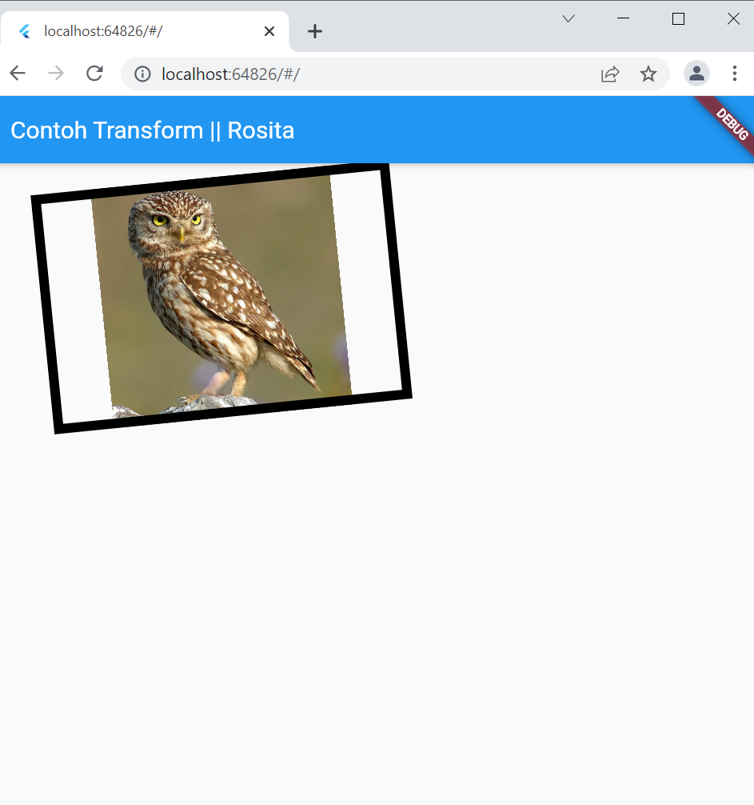
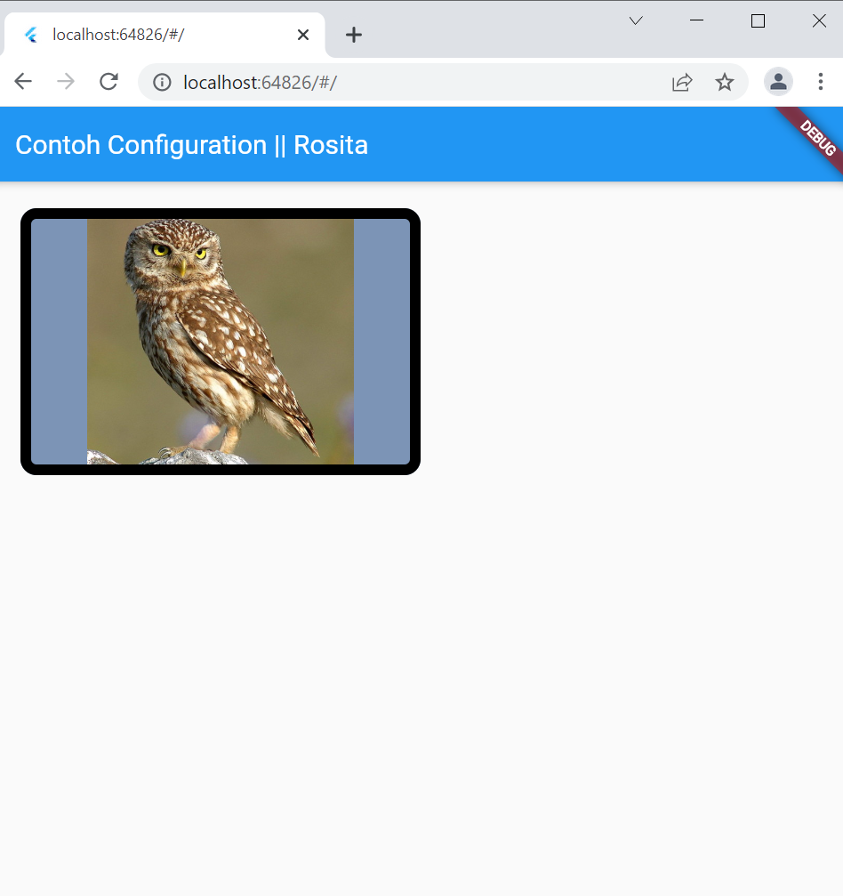
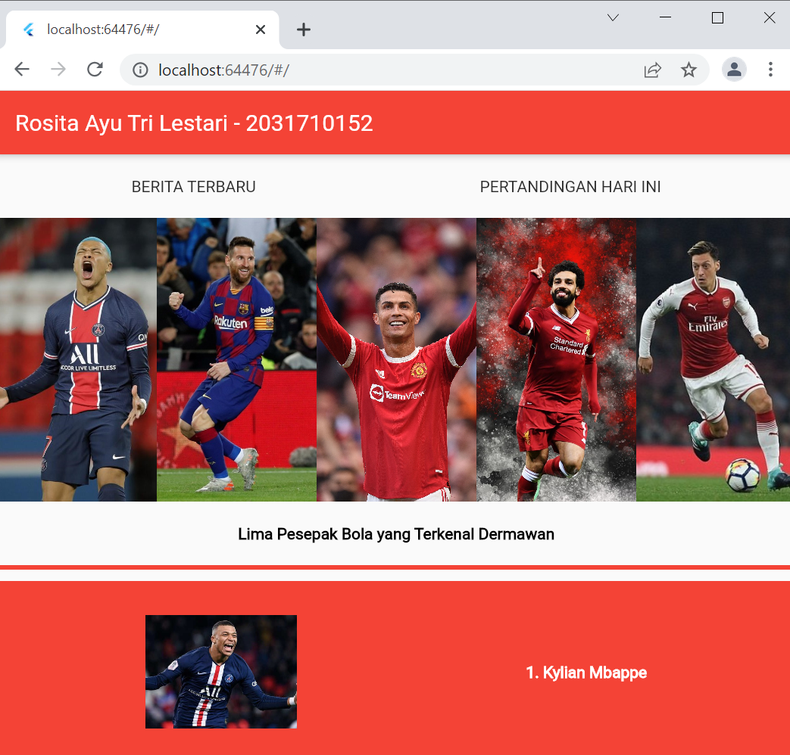

# flutter_application_2

NAMA : ROSITA AYU TRI LESTARI 
NIM  : 2031710152  
KELAS : MI 2C  
PRODI : D3-MI  

## HASIL PRAKTIKUM
## 1. Text Widget

## 2. Image Widget

## 3. Cupertino Widget

## 4. Button Widget

## 5. Scaffold Widget

## 6. Dialog  Widget

## 7. Input dan Selection Widget

## 8. Date and Time Pickers  

## 9. Property child

## 10. Property alignment

## 11. Property color

## 12. Property height dan width

## 13. Property margin

## 14. Property padding

## 15. Property transform

## 16. Property decoration

## 17. Column Widget 

## 18.  Row Widget 

## 19. Stack Widget

## 20. ListView widget 

## 21. Gridview

## TUGAS PRAKTIKUM

